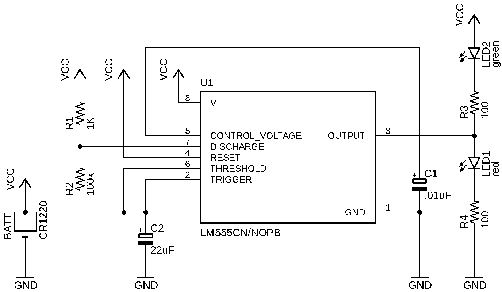
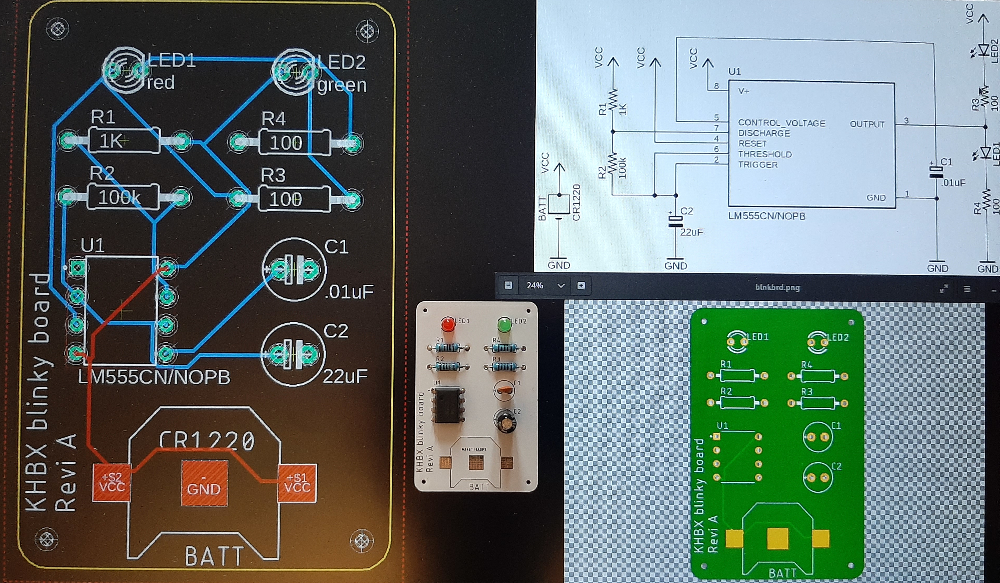

# Blinky board

Simple blinking board using a 555 timer. 

PCB designed using EAGLE.

## Schematics

## Pictures

## Blinking period

t1 = 0.693 (R1 + R2) * C2 = 0.693 (1000 + 100 000) * 22*10^-6 = 1.53

t2 = 0.693 (R2) * C2 * 22 * 10^-6 = 1.53

Period = t1 + t2 = 3 sec

